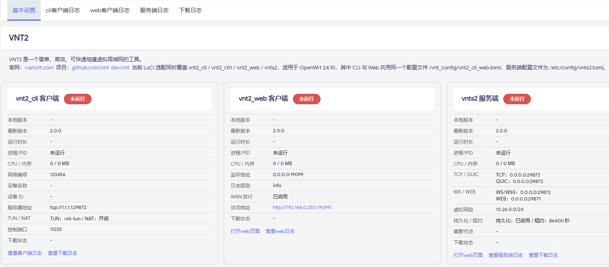
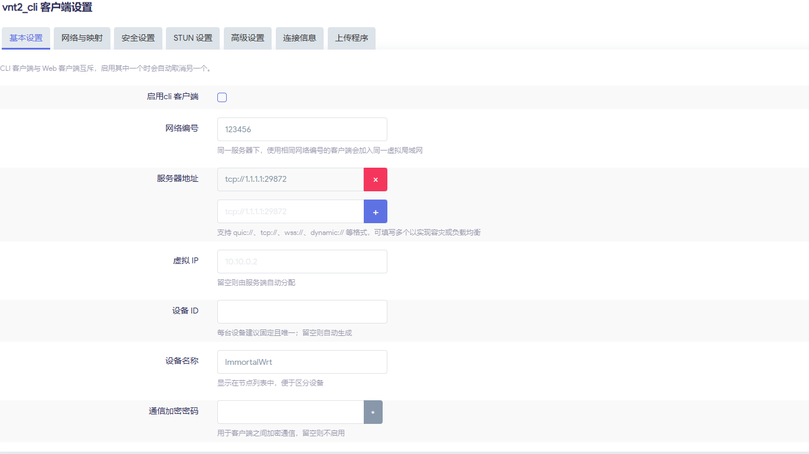

# luci-app-vnt2

## 部署方法

### 1. 从 GitHub Release 安装

Release tag 例如 `v2.0.40` 时，会发布：

- `luci-app-vnt2_v2.0.40.ipk`
- `luci-app-vnt2_v2.0.40.apk`

#### OpenWrt 24.10.x

将 `luci-app-vnt2_vX.Y.Z.ipk` 上传到路由器，例如 `/tmp/`，然后执行：

```sh
opkg install /tmp/luci-app-vnt2_vX.Y.Z.ipk
```

#### OpenWrt 25.12.0

将 `luci-app-vnt2_vX.Y.Z.apk` 上传到路由器，例如 `/tmp/`，然后执行：

```sh
apk add --allow-untrusted /tmp/luci-app-vnt2_vX.Y.Z.apk
```

### 2. 在 OpenWrt 源码树中编译后部署

将本项目放入 OpenWrt 的 `package/` 或自定义 feed 中，例如：

```sh
git clone <your-repo-url> package/luci-app-vnt2
```

选择插件并编译：

```sh
make menuconfig
make package/luci-app-vnt2/compile V=s
```

编译完成后：

- OpenWrt 24.10.x 安装生成的 `.ipk`
- OpenWrt 25.12.0 安装生成的 `.apk`

### 3. 安装后入口

安装完成后，在 LuCI 中进入：

```text
VPN -> VNT2
```

首次启用客户端或服务端后，插件会按当前配置自动下载或使用已上传的 `vnt2_cli`、`vnt2_ctrl`、`vnt2_web`、`vnts2` 程序。

## 界面截图

### 状态总览



### `vnt2_cli` 客户端设置



### `vnt2_web` 客户端设置


### `vnts2` 服务端设置


