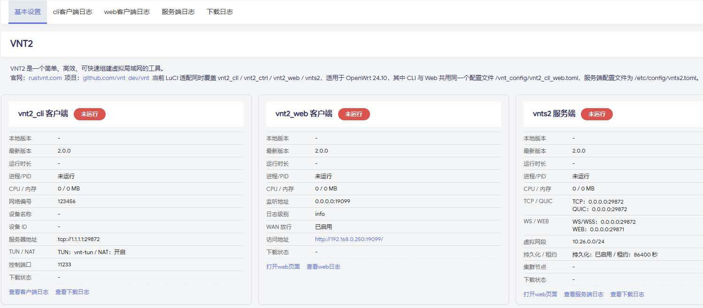
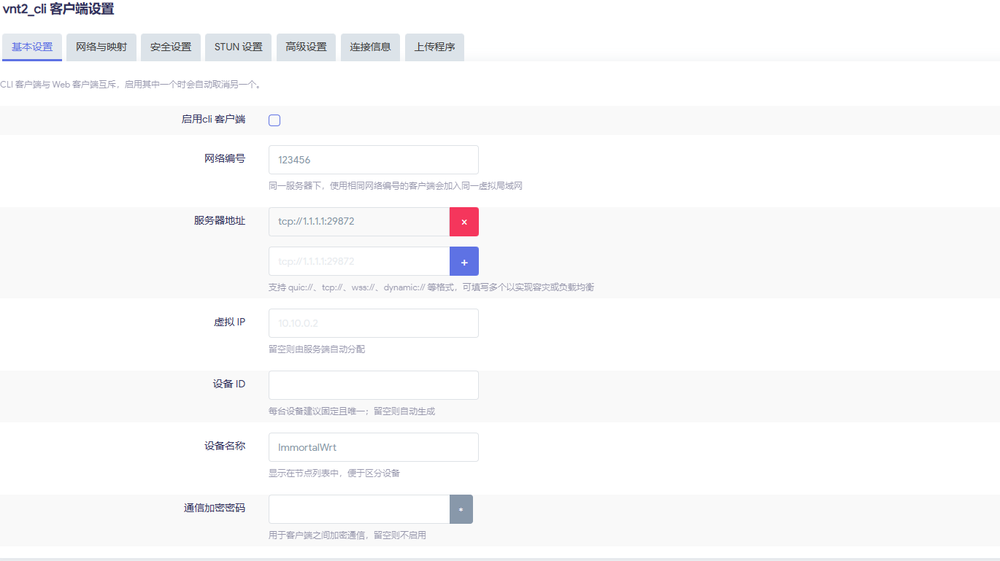

# luci-app-vnt2

这是一个用于管理 VNT2 CLI / CTRL / Web 服务的 OpenWrt LuCI 插件。

## 包名称说明

OpenWrt 软件包管理器中的实际包名固定为：

- `luci-app-vnt2`

无论是在 `系统 -> 软件包` 页面中搜索，还是使用 `opkg` / `apk` 查询，实际包名都应当使用 `luci-app-vnt2`。

## 发布文件说明

GitHub Release 中发布的安装文件，保留 OpenWrt 标准构建产物命名方式。
文件名中可能带有版本号、发布号、架构等后缀，但软件包名前缀始终为：

- `luci-app-vnt2`

例如：

- `luci-app-vnt2_2.0.40-r1_all.ipk`
- `luci-app-vnt2-2.0.40-r1.apk`

## 安装方法

### OpenWrt 24.10.x

将 `.ipk` 文件上传到路由器，例如上传到 `/tmp/`，然后执行：

```sh
opkg install /tmp/luci-app-vnt2*.ipk
opkg info luci-app-vnt2
opkg list-installed | grep luci-app-vnt2
```

### OpenWrt 25.12.0

将 `.apk` 文件上传到路由器，例如上传到 `/tmp/`，然后执行：

```sh
apk add --allow-untrusted /tmp/luci-app-vnt2*.apk
apk info luci-app-vnt2
```
## 卸载方法
```sh
opkg remove luci-app-vnt2
opkg remove vnt2
```

## 在 OpenWrt 源码树中编译

可将本项目放入 OpenWrt 的 `package/` 目录，或放入自定义 feed 中，然后执行：

```sh
git clone <你的仓库地址> package/luci-app-vnt2
make menuconfig
make package/luci-app-vnt2/compile V=s
```

编译完成后：

- OpenWrt 24.10.x 生成 `.ipk`
- OpenWrt 25.12.0 生成 `.apk`

## LuCI 菜单位置

安装完成后，在 LuCI 中进入：

```text
VPN -> VNT2
```

## 截图

### 状态总览



### `vnt2_cli` 客户端配置



### `vnt2_web` 客户端配置


### `vnts2` 服务端配置


